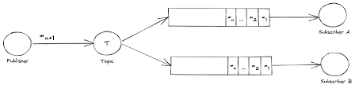
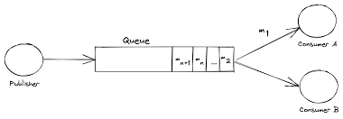

### Pub-Sub Pattern vs Message Queue Pattern
  

  

	If your system requires broadcasting messages to multiple recipients or you're building an event-driven architecture, 
	pub/sub might be the better choice. 
 
 	If you need to ensure that each message is processed by exactly one consumer, or you require FIFO ordering, then 
  	message queues are likely the way to go.

